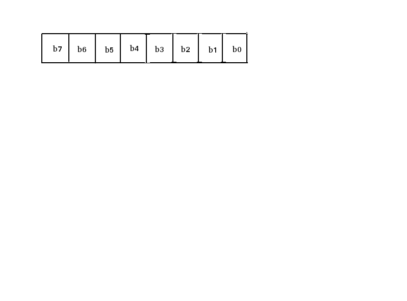

<h2> SEF </h2>


a symmetry encryption algorithm based on fountain code.

<h2> Feature </h2>

+ PKCS7 padding and depadding
+ symmetry
+ support key bits from zero to 256 that's times of 8

<h2> Algorithm Design </h2> 

this algorithm just use the bitwise **xor** to encrypt the message, but it cycle the key, and use a mask to 
cover the key, so it's really difficute to guess the start encrypt data block without know the key.

for a block data of 64 bits, the encrypt process start with the source block data on the first turn, but the second turn will base on the previous result. so if one want to decrypt the source data, he or  she need to inverse the process with [8, 16, 32, 64, 128, 256] turns with the exact key [256, 65526, 4294967296, ...]. the complexity grows very fastly.

for fast encrypting and decrypting data, the main algorithm use the static c
types.

<h2> Encryption </h2> 

encrypt process for a block of data with 8 bit key



<h2> Decryption </h2>

decrypt process for a block cliper with 8 bit key


<h2> Install </h2>

``` shell

	python setup.py build_ext
	python setup.py install
	
```

<h2> Tester </h2>

requirements:

+ gnuplot
+ matplotlib
+ cython
+ scipy

current tester:

+ key bits length tester
+ message length tester
+ common symmetric data encryption
+ binary tester, images, voice, video

``` shell

./tester --help

```

<h2> Author </h2> 

smileboywtu@gmail.com
